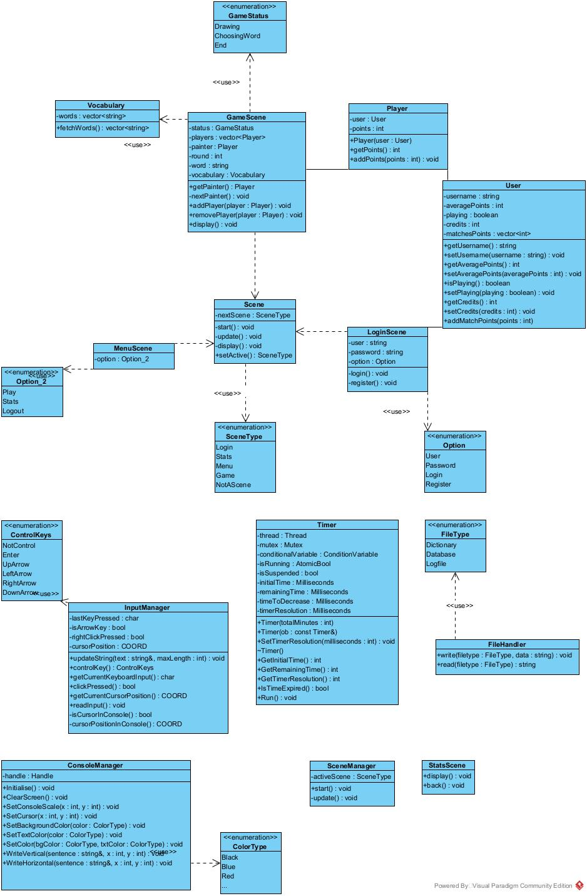

# ?
`Gartic` is a team project currently in development for the MC++ 2023-2024 (**M**odern **C++**) course held at Transilvania University of Brasov's [Faculty of Mathematics and Computer Science](https://mateinfo.unitbv.ro) (study programme: Computer Science).

# Team members
- Teglas Dennis-Vlăduț • [github](https://github.com/tdenniss) • [dennis.teglas@student.unitbv.ro](mailto:dennis.teglas@student.unitbv.ro)
- Stoica David-Ioan • [github](https://github.com/stoica-david) • [david.stoica@student.unitbv.ro](mailto:david.stoica@student.unitbv.ro)
- Tufeanu Andrei-Ionuț • [github](https://github.com/andreitufeanu) • [andrei.tufeanu@student.unitbv.ro](mailto:andrei.tufeanu@student.unitbv.ro)
- Sas Vlad-Ștefan • [github](https://github.com/vlsts) • [vlad.sas@student.unitbv.ro](mailto:vlad.sas@student.unitbv.ro) • [pgp key](https://keys.openpgp.org/search?q=F8D3E2ADBA5E662AB903A09B1E36736E712E97C7) (commits signed with this key)

# Build requirements

- `vcpkg` ([link](https://vcpkg.io/en/getting-started)) + the following packages:
    - `picosha2`
    - `crow` v1.0-5
    - `cpr` 
    - `qtbase` v6.5.3
    - `sqlite-orm`
- `MSVC 2022`([link](https://visualstudio.microsoft.com/vs/features/cplusplus/))

Everything besides `vcpkg` and `MSVC 2022` will be automatically installed when building the projects (little exception: GUI) but make sure vcpkg is on the latest commit! (go into the vcpkg folder and run `git pull`)

## Installing `vcpkg`

- Clone [this](https://github.com/microsoft/vcpkg.git) repository wherever you would like to have vcpkg installed
- Open a terminal
  - `cd` into the vcpkg folder
  - run the bootstrap script (`bootstrap-vcpkg.bat`)
- Set the following environment variables
  - `VCPKG_ROOT` to wherever your vcpkg folder is located
  - Change `Path` and add `%VCPKG_ROOT%` to it
- Close all of your Visual Studio instances and also any opened terminals
- Open a terminal and run `vcpkg integrate install`

## Building the GUI Client
- Build the client (it will take a long time)
- At first it will fail to build
- Open a terminal
    - `cd` into the root repo directory (the one where this readme is)
    - enter the following commands:
        - `vcpkg install --x-feature guiclient`
        - `mklink /J "x64-windows\tools\Qt6\mkspecs" "x64-windows\share\Qt6\mkspecs"`
- Build again

# Project info
- Duration: 10 weeks, 23rd of October -> 14th of January
- Project coordinator: Popa Iulian
- Points:
    - Base requirements: max. 8 pts
    - Advanced requirements: max. 2 pts
    - Custom element: max. 1 pt
- Demo Video explaining code segments + showcasing app functionality required (deadline: 14th of January)
- Allowed libraries / frameworks
    - [SDL](https://www.libsdl.org/)
    - [SFML](https://www.sfml-dev.org/)
    - [Qt](https://qt.io)
    - [nlohmann/json](https://github.com/nlohmann/json)
    - [fnc12/sqlite_orm](https://github.com/fnc12/sqlite_orm)
    - others, if the project coordinator allows using them

# Base requirements (max. 8 pts)
- ✅ Networking: respect client-server architecture (at least 2 client instances + 1 server)
- ✅ Login / Register page
- ✅ Game Page: console app that substitutes drawing the word with describing it while not using words in the lexical family of said word
- ✅ Use at least 500 words, each match will have unique and random words
- ✅ Database: must use SQLite through [fnc12/sqlite_orm](https://github.com/fnc12/sqlite_orm)

# Advanced components (max. 2 pts)
- ✅ Meeting room: player uses a code to join other players
- ✅ Profile page: the profile page contains a game history (scores for each game and average of said scores)
- ✅ GUI: drawing version of the game using Qt

# Custom element ideas (max. 1 pt)
- ❌ Difficulty setting: Easy/Medium/Hard; this should affect the number of hints and the dynamics of the game
- ❌ Buying clues using points obtained during the game, the cost of each being stored in the database with the cost being related to each word
- ✅ Handling more than 2 games at once on the server
- 🟨 Handling exceptions and implementing unit tests (coverage 50%)

# Custom elements
- ✅ Console Client
- ✅ Adjustable word count, timer and round count
- ✅ Hashed passwords before sending to server
- ✅ Fill, Undo, adjustable brush size drawing tools
- ✅ Chat filter 
- ✅ MOTD / Cafeluta
- ✅ Word proximity detector (If the word is close it will not be shown to others)

# Initial UML Diagram (Outdated)
